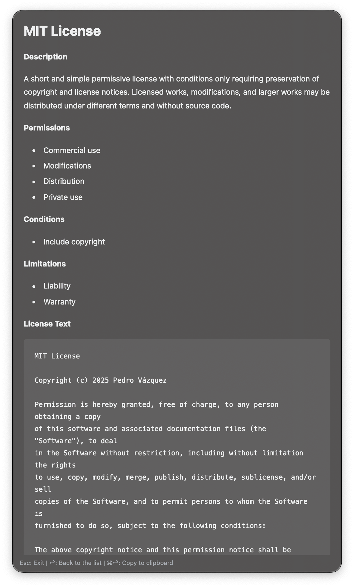

#  Choose License | Alfred Workflow

Choose a license from the most commonly used licenses on GitHub directly in Alfred.

## Download

- You can download it directly from GitHub [here](https://github.com/vanstrouble/choosealicense-alfred-workflow/releases/latest).

## Usage

Type your search query in Alfred using your configured keyword (default: `lic` or your preferred trigger).

- **Keyword:** `[your-keyword] [search query]`.
- **Action:** Press `Enter` to copy the license text to clipboard.
- **Paste:** Hold `⌘` (Command) and press `Enter` to paste license into frontmost app.
- **Preview:** Hold `⌥` (Option/Alt) and press `Enter` to view the detailed license in the Text Viewer.
- **Quick Look:** Press `⇧` (Shift) or `⌘Y` to preview license on choosealicense.com.

## Features

- **Fast license search** by name.
- **Smart caching** with yearly refresh. Licenses are fetched once and cached locally for fast offline access.
- **License preview** in Alfred's Text Viewer with formatted Markdown including permissions, conditions, and limitations.
- **Automatic personalization** replaces placeholder text with your name from workflow configuration.
- **Quick actions** to copy license text to clipboard or paste directly into frontmost application.
- **Visual previews** with Quick Look support to view full license details before selecting.
- **Hotkey support** to assign custom keyboard shortcuts in Alfred for instant workflow access.
